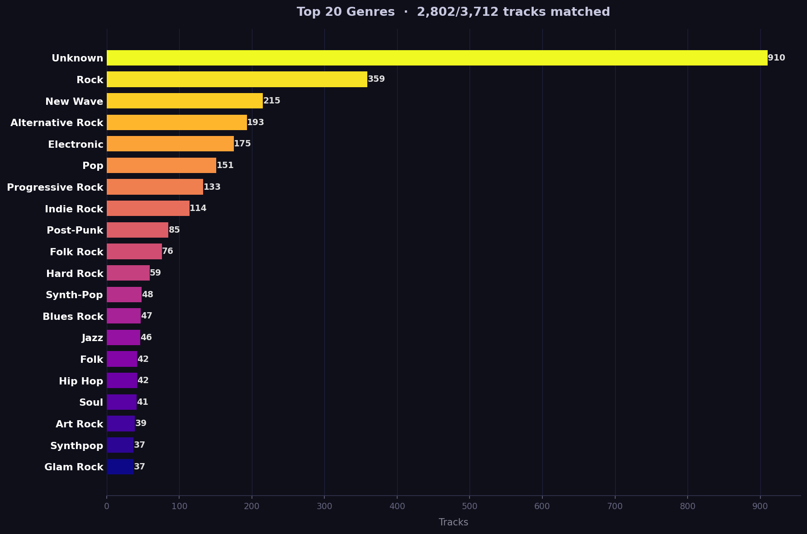

# muziqa

Analyze your music collection and generate interesting charts using command-line:
- **Top artists** by track count
- **Tracks by decade**
- **Tracks by year**, with a 5-year rolling average of mean tracks per artist
- **Tracks by country** (optional, see below)
- **Tracks by genre** (optional, see below)


Also create MP3 playlist using Anthropic Claude LLM. The generated playlist is an MP3 file of your songs, picked by AI, per your prompt. Example:

```
$ muziqa Music --playlist "Playlist of rock tunes where lead guitar is as close as possible to the picking style of Mark Knopfler. Max 1 hour. Max one song per artist." --playlist-output mark.mp3
```

## Install

```
$ pipx install muziqa
```

Works on Linux, Mac. Probably Windows too, but I didn't test it.

## Usage

No API keys, no accounts, no streaming service — just point muziqa to a folder of music files:

```
$ muziqa /path/to/music
```


Reads tags from all supported files in the folder and subfolders, and saves two charts:
- `muziqa.png` — top artists + tracks by decade
- `muziqa_years.png` — tracks by year with rolling average

Supported formats: **MP3, FLAC, WAV, M4A, OGG**

### Country and genre charts

```
$ muziqa /path/to/music --country
$ muziqa /path/to/music --genre
$ muziqa /path/to/music --country --genre
```

Looks up each artist's country of origin and genre from [MusicBrainz](https://musicbrainz.org) and saves additional charts:
- `muziqa_country.png` — tracks by country
- `muziqa_genre.png` — tracks by genre




> **Note:** The first run with `--country` or `--genre` queries MusicBrainz for every unique artist at 1 request/second (required by their API). For a large collection this can take a bit of time. Using both flags together does **not** double the time — data is fetched in a single pass. Results are cached in `muziqa_mb_cache.json` so subsequent runs are instant.

> **Note on "Unknown" genre:** This means MusicBrainz either didn't find the artist or has no community-submitted genre tags for them. It does not affect the rest of the chart.

### All options

| Option | Description |
|--------|-------------|
| `DIR` | Directory of music files to analyze |
| `--flat` | Search only the given folder, not subfolders |
| `--country` | Fetch artist countries from MusicBrainz and plot by country |
| `--genre` | Fetch artist genres from MusicBrainz and plot by genre |
| `--output FILE` | Output image filename (default: `muziqa.png`) |
| `--top N` | Number of top entries to show (default: 20) |
| `-playlist DESC` | Create a playlist MP3 matching the given description (requires ANTHROPIC_API_KEY and ffmpeg) |
| `--playlist-output FILE` | Output file for playlist (default: playlist.mp3) |
| `--model MODEL` | Claude model for --playlist (default: claude-sonnet-4-6). Tip: use 'llm-models -p Anthropic' to list available models --> github.com/ljbuturovic/llm-models|

### Examples

```
$ muziqa ~/Music
$ muziqa ~/Music --flat
$ muziqa ~/Music --country --genre
$ muziqa ~/Music --top 30 --output top30.png
```
