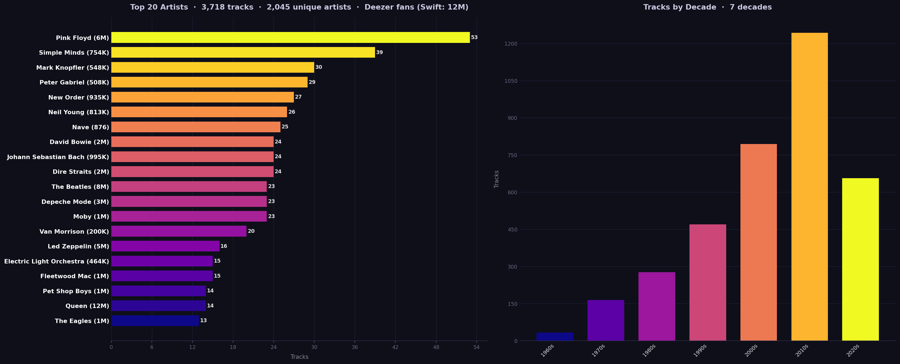
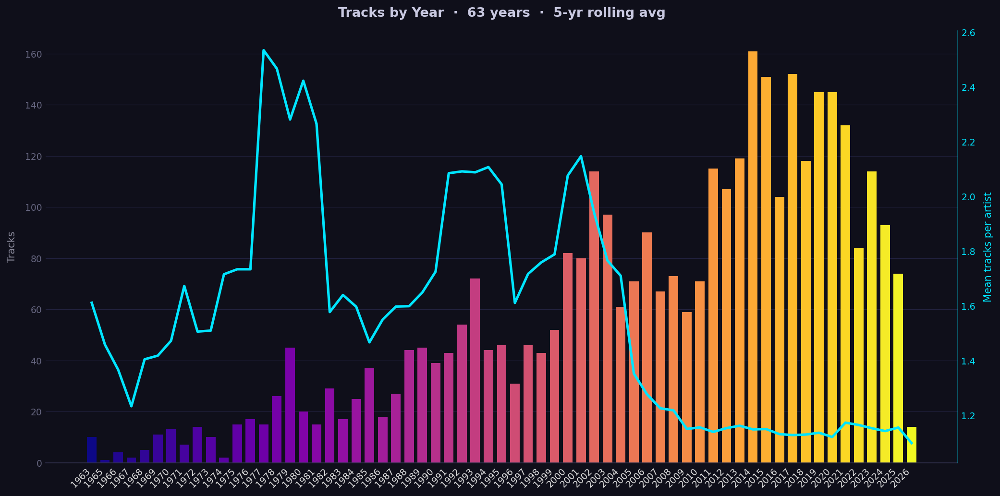
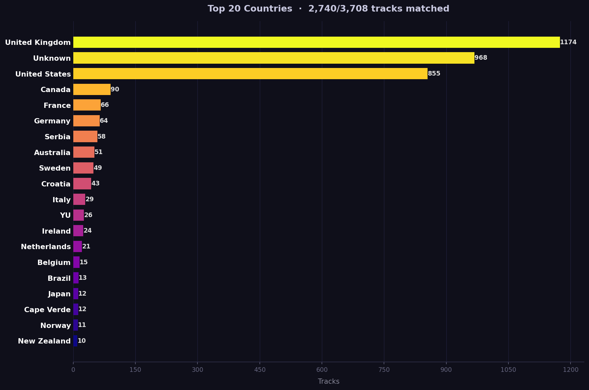

# muziqa

Analyze your MP3 music collection and generate interesting charts:
- **Top artists** by track count
- **Tracks by decades**
- **Tracks by year**, with a 5-year rolling average of mean tracks per artist
- **Tracks by country**





## Install (Linux/Mac)

```
$ pipx install muziqa
```

## Usage

Point it at a folder of music files:

```
$ muziqa /path/to/music
```

Reads tags from all supported files in the folder and subfolders, and saves the charts to `muziqa.png` and `muziqa_years.png` in the current directory.

Supported formats: **MP3, FLAC, WAV, M4A, OGG**

### Options

| Option | Description |
|--------|-------------|
| `DIR` | Directory of music files to analyze |
| `--flat` | Search only the given folder, not subfolders |
| `--output FILE` | Output image filename (default: `muziqa.png`) |
| `--top N` | Number of top artists to show (default: 20) |

### Examples

```
$ muziqa ~/Music
$ muziqa ~/Music --flat
$ muziqa ~/Music --top 30 --output top30.png
```
